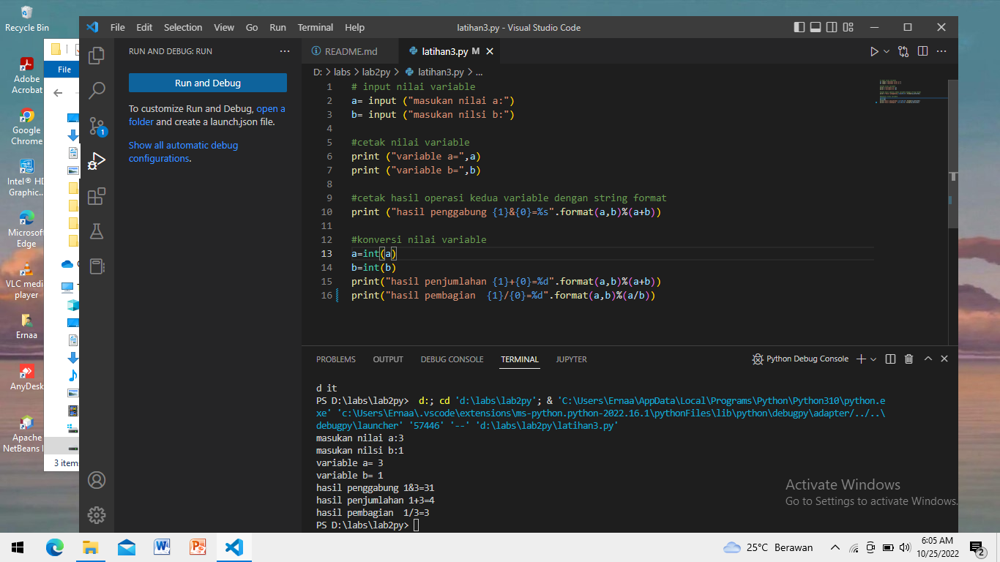

# lab2py

## Latihan 1
# - Menjalankan Python Console
1 Menanpilkan Tulisan "Hello" di layar
2 Manampilkan Tulisan "Saya Sedang Belajar Python" di layar

## Latihan 2
# - Mmenjalankan 2 buah bilangan menggabungkan variable a dan b
1 Mendefisinikan variable a dengan nilai 8
2 Mendifinisikan variable b dengan nilai 6
3 Mencetak hasil penjumlahan a+b

## Latihan 3
# - Menjalankan IDLE
1 Menambahkan file baru dengan nama latihan3.py (pastikan lokasi file pada folder lab2py pada direktori kerja anda)
2 Mwnggunakan fungsi input untuk mengambil nilai variable dari keyboard
1. # input nilai variable
2. # cetak nilai variable
3. # cetak hasil operasi kedua variable dengan string format
4. # konversi nilai variable
## FYI jika TypeError: %d format: a number is required, not str"
## Jika args adalah daftar atau tupel, %dapat digunakan sebagai pengganti dalam kueri.Jika args adalah dict, %(name)s dapat digunakan sebagai placeholder dalam kueri
